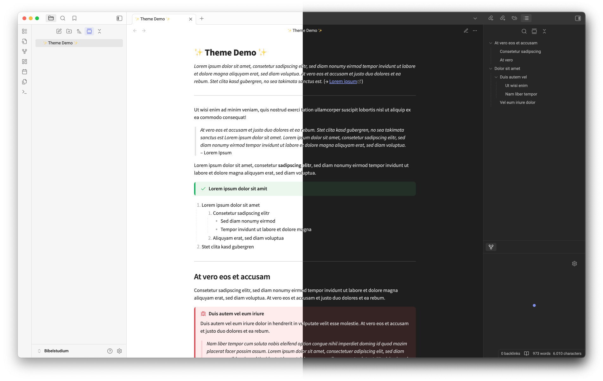

# Minimalist Studio Theme
This is a theme that aims to improve the styles of **callouts**, **blockquotes** and lists,
together with some minor tweaks to make it overall prettier, while keeping the typical Obsidian design.
 

## Installation
1. Click `Settings → Appearance → Theme → Manage`
2. Search for "Minimal Pro" and click "Install and use"
